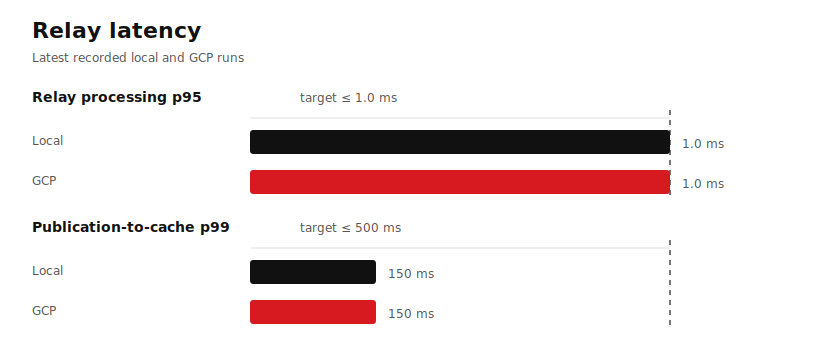
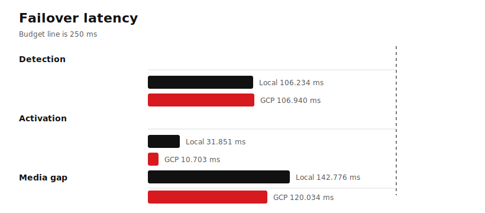
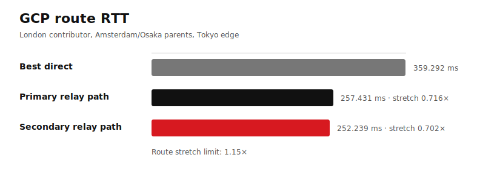
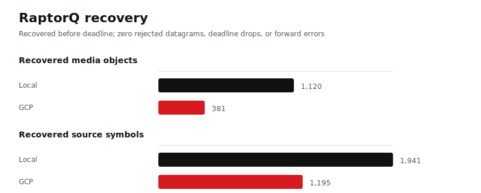

<p align="center">
  
</p>

<p align="center">
  The Wavey Goose is our mascot, but the Needletail is the fastest bird in level flight...
</p>

# Needletail

Needletail is the product-level repo for Wavey realtime media delivery. It
composes, runs, observes, and tests the service constellation. Core services
and reusable crates stay in their own repos.

**Measured 48 kHz lossless latency:** with 5 ms parts over one persistent,
certificate-verified TLS 1.3/H3 connection, correctly implemented LL-HLS is
raw UDP plus a few milliseconds. In the latest London-origin, dual-parent GCP
mesh run, raw 16-channel S24 PCM stayed PCM and reached LL-HLS at **55.728 ms
in New York, 127.506 ms in Tokyo, and 148.549 ms in Sydney at p50**. Raw UDP
measured 53.338, 125.054, and 146.129 ms: an LL-HLS premium of only
**2.390–2.452 ms**. Once a part reached its regional cache, H3 delivery was
below 1.51 ms at p99. A post-deploy New York canary repeated both eight-channel
PCM renditions with 400/400 parts, zero deadline misses, and 1.03–1.37 ms
cache-to-client p99. These are publication-to-client availability results, not
browser-to-speaker latency.

Needletail owns:

- multi-service topology and desired-state generation;
- local and deployed orchestration;
- the operations dashboard;
- product observability;
- real-world impairment, failover, latency, and RaptorQ recovery tests;
- deployment composition around native binaries and `systemd`.

Contributor-product integrations live in their owning app repos and integrate
through Needletail's generic ingest, capability, and session APIs.

## Service constellation

Current components:

| Component | Owner responsibility |
| --- | --- |
| `av-contrib` | Per-stream origin ingest, FEC recovery, codec-preserving lossless packaging, and bounded publication to a dedicated mesh ingress. |
| `av-mesh` | Playback edge, LL-HLS cache adapter, relay-node behavior, telemetry, and product-asset hosting. |
| `media-object` | Canonical immutable media-object identity, bounded v1 envelope, payload integrity, dependencies, deadlines, and source-known timestamps. |
| `raptor-fec` | Adaptive RaptorQ geometry, source-first scheduling, repair policy, deadline outcomes, and FEC-versus-fetch decisions. |
| `relay-session` | Authenticated carrier sessions, subscriptions, symbol forwarding, reliable object fetch, queue admission, and expiry. |
| `playlists` | Bounded chunk/manifest caches and immutable slot-write semantics used by playback edges. |
| `av-service` | Shared HTTP, HLS, and upload-response services. |

The hot path is:

```text
Contributor ingest
  -> canonical media object
  -> RaptorQ source and repair symbols
  -> deadline and path scheduler
  -> RelayTransport datagram carrier
  -> dual-parent relay DAG or direct fast path
  -> playback edge cache
  -> LL-HLS or interactive delivery
```

RaptorQ is the live-media recovery system. QUIC Datagram is an optional carrier
for authenticated, encrypted, paced datagrams. Reliable streams are for control,
initialization, and backfill.

Lossless 48 kHz Audio Epoch publications have three simultaneous delivery
lanes: mandatory lossless fMP4 LL-HLS, optional browser WebTransport datagrams,
and optional native UDP+FEC subscriptions at a relay or playback edge. PCM
remains PCM (`ipcm`/`fpcm`) and FLAC remains FLAC. See
[Audio delivery lanes](docs/audio-delivery-lanes.md) for the wire contracts,
format behavior, and local/GCP qualification commands. The contributor performs
stream-dependent work once and never doubles as a relay; see the
[Contributor origin boundary](docs/contributor-origin-boundary.md).

## Operations dashboard

Mission Control is the Needletail-owned operations UI. It renders contributor
ingest, compiled delivery routes, RelaySession lanes, RaptorQ recovery,
publication continuity, latency, and alerts from bounded service snapshots.

It reads:

- `av-contrib` `GET /api/status`;
- `av-mesh` `GET /api/mesh`.

Default same-origin edge feed: `/api/mesh`.
Default contributor feed: `https://local.bitneedle.com:19443/api/status`.

Override feeds with:

```text
/mesh?edge=https://edge.example/api/mesh&contrib=https://ingress.example/api/status
```

Build and check the dashboard:

```sh
make mission-control-check
make mission-control-test
make mission-control-build
```

### Dashboard screenshots from the latest GCP run

Run: `20260716T023139Z`.
Topology: London contributor, Amsterdam primary relay, Osaka secondary relay,
Tokyo playback edge. Four `e2-standard-2` GCP instances.

#### Overview


#### Routes


#### Performance


## Latest real-world results

Latest raw-PCM GCP DAG and H3 capacity ladder: `20260717T222106Z`.
Latest six-node Linode DAG replication run: `20260717T145432Z`.
Latest three-lane 48 kHz lossless GCP run: `20260717T054206Z`.
Latest local persistent-H3 lossless run: `20260717T053347Z`.
Latest complete intercontinental failover run: `20260716T023139Z`.

The raw-PCM run delivered both eight-channel LL-HLS renditions without loss to
New York, Tokyo, and Sydney, then established a strict short-run edge boundary:
25 simultaneous 16-channel customers passed on a two-vCPU `n2-standard-2`; 32
failed. See the [raw PCM H3 capacity record](docs/real-world-tests/2026-07-17-pcm-h3-capacity.md).
The earlier Linode run delivered all 2,400 five-millisecond epochs or parts to
independent New York, Tokyo, and Sydney caches in clean and impaired profiles.
It also proved byte-identical replication, late join, cache independence,
cross-parent FEC recovery, and primary-parent failover. See the
[17 July multi-region DAG record](docs/real-world-tests/2026-07-17-linode-dag-replication.md).
The earlier GCP lossless run delivered all 2,000 five-millisecond epochs or
parts in clean and two-percent-loss profiles. See the
[17 July lossless H3 record](docs/real-world-tests/2026-07-17-lossless-h3.md)
for p50/p95/p99 latency, wire, CPU, queue, recovery, and test-boundary details.

### Latest multi-region clean-path result

| City | UDP p50 | WebTransport p50 | LL-HLS p50 | LL-HLS premium | LL-HLS p99 | Cache→client p99 |
| --- | ---: | ---: | ---: | ---: | ---: | ---: |
| New York | 53.338 ms | 53.595 ms | 55.728 ms | 2.390 ms | 57.137 ms | 1.510 ms |
| Tokyo | 125.054 ms | 125.130 ms | 127.506 ms | 2.452 ms | 128.824 ms | 1.274 ms |
| Sydney | 146.129 ms | 146.268 ms | 148.549 ms | 2.420 ms | 150.265 ms | 1.460 ms |

The wide-area network accounts for almost all publication-to-cache latency;
the persistent H3 LL-HLS architecture adds only a few milliseconds over the
raw datagram lane.

### Performance charts









### Earlier GCP gate results

| Metric | Local | GCP | Target |
| --- | ---: | ---: | ---: |
| Relay processing p95 | 1.0 ms | 1.0 ms | <= 1.0 ms |
| Publication-to-cache p99 | 150 ms | 150 ms | <= 500 ms |
| Failover detection | 106.234 ms | 106.940 ms | <= 250 ms |
| Failover activation | 31.851 ms | 10.703 ms | <= 250 ms |
| Media gap during failover | 142.776 ms | 120.034 ms | <= 250 ms |
| RaptorQ recovered objects | 1,120 | 381 | zero receive/drop regressions |
| RaptorQ recovered source symbols | 1,941 | 1,195 | zero receive/drop regressions |

### GCP route measurements

| Path | Measured RTT | Stretch limit | Observed stretch |
| --- | ---: | ---: | ---: |
| London -> Tokyo direct | 250.915 ms | - | 1.000x |
| London -> Amsterdam -> Tokyo | 244.127 ms | <= 1.15x | 0.972947x |
| London -> Osaka -> Tokyo | 251.904 ms | <= 1.15x | 1.003942x |

The sub-millisecond numbers in the dashboard are relay processing times inside
the service. Intercontinental network latency is measured in the RTT table.

| Path | Distance | Measured RTT | Vacuum lower bound | Ideal-fiber lower bound | Factor vs vacuum | Factor vs ideal fiber |
| --- | ---: | ---: | ---: | ---: | ---: | ---: |
| London -> Tokyo direct | 9,558.6 km | 250.915 ms | 63.8 ms | 93.7 ms | 3.93x | 2.68x |
| London -> Amsterdam -> Tokyo | 9,645.9 km | 244.127 ms | 64.4 ms | 94.6 ms | 3.79x | 2.58x |
| London -> Osaka -> Tokyo | 9,891.8 km | 251.904 ms | 66.0 ms | 97.0 ms | 3.82x | 2.60x |

Observed one-way latency is roughly `122-126 ms`. An ideal straight fiber path
is roughly `47-49 ms` one way, so the extra `75-79 ms` is provider routing,
cloud network path, queueing, and host overhead.

### GCP failover and RaptorQ recovery

The deployed run stopped and restored the primary relay, then injected
controlled loss on the primary source path.

| Check | Result | Gate |
| --- | ---: | ---: |
| Contributor restart max relay activation | 1.628260 s | <= 10 s |
| Failover detection | 106.940 ms | <= 250 ms |
| Promotion to source | 10.703 ms | <= 250 ms |
| Maximum media gap | 120.034 ms | <= 250 ms |
| Canonical publication max lag after recovery | 4 objects | <= 4 objects |
| Controlled primary-path loss | 70 dropped datagrams | recovered before deadline |
| Exact RaptorQ recovery | 381 objects / 1,195 source symbols | > 0, no regressions |
| Expired / rejected / deadline drops during gated fault phases | 0 / 0 / 0 | 0 / 0 / 0 |
| Warm source replay during promotion | 38 datagrams | > 0 |

The failover state sequence was:

```text
healthy -> promoted -> healthy
```

### Dashboard load

`h2load` ran against the Tokyo edge through the local SSH tunnel.

| Metric | Result |
| --- | ---: |
| Duration | 60 s |
| Connections | 8 |
| Streams per connection | 4 |
| Requests | 6,520 |
| Success | 6,520 |
| Failed / errored / timed out | 0 |
| Throughput | 108.67 req/s |
| Mean request time | 290.71 ms |
| Max request time | 976.55 ms |

Final post-load API snapshot:

- alerts: `0`;
- edge contiguous at head: `15307 / 15307`;
- rejected datagrams: `0`;
- deadline drops: `0`;
- decoded objects: `17,086`;
- FEC-recovered objects: `16,716`;
- recovered source symbols: `52,347`.

Cumulative dashboard counters after the gate and dashboard load showed `6`
expired objects and a historical maximum failover gap of `2.618526 s`. Those
counters are follow-up operating data, separate from the gated failover result.

Versioned evidence summary:

```text
docs/real-world-tests/evidence/20260716T023139Z.json
docs/real-world-tests/evidence/20260717T054206Z.json
```

The GCP lab was torn down after capture: instances, firewall rules, subnets, and
VPC were removed.

## Relay fabric

Needletail compiles a forwarding graph for every stream and destination cohort.
The graph combines a scalable dual-parent DAG with a tightly connected backbone
overlay for the lowest-latency delivery class.

The controller manages two related structures:

1. the session overlay, which describes authenticated carrier connectivity
   between trusted relays;
2. the per-stream forwarding graph, which selects one primary and up to one
   secondary upstream for each relay or playback edge.

This keeps failover candidates warm while every media object follows an
explicit acyclic route.

Forwarding invariants:

- exactly one origin for a stream graph at level 0;
- one primary upstream for every downstream node;
- up to one secondary upstream;
- parents at an earlier level than their children;
- provider, region, ASN, and physical-zone diversity between dual parents;
- origin child limit, initially four;
- configured downstream child limits per relay;
- no more than `2 × (node count - 1)` upstream relationships;
- explicit stream subscriptions before object forwarding;
- idempotent generation and subscription application;
- make-before-break parent changes with generation fencing.

Parent roles:

- primary parent carries live source symbols;
- secondary parent keeps subscription and object state warm;
- secondary parent can supply RaptorQ repair symbols, reliable missing-object
  fetches, duplicated initialization/keyframe objects, and immediate takeover.

Delivery classes:

| Class | Forwarding shape | Playback lane | Initial hard limits |
| --- | --- | --- | --- |
| Interactive | direct or one-backbone-hop dual-parent fast path | interactive edge protocol | one inter-region relay, 1.15x stretch, relay p95 <= 1 ms, media queue p95 <= 5 ms |
| Premium live | dual-parent regional DAG | object delivery or tightly tuned LL-HLS | two inter-region relays, 1.25x stretch, relay p95 <= 1 ms, queue p95 <= 5 ms |
| Mass broadcast | bounded multi-level dual-parent DAG | LL-HLS/H3 | two inter-region relays, 1.50x stretch, relay p95 <= 2 ms, queue p95 <= 10 ms |
| Resilient contribution | best regional ingress plus independent upstream | SRT, RIST, or WHIP | two inter-region relays, 1.25x stretch, relay p95 <= 1 ms, queue p95 <= 5 ms |

Direct ingress-to-edge delivery remains a candidate for interactive cohorts.
The controller chooses it when measured performance wins and keeps the best
independent relay path warm.

Route scoring uses:

- RTT p50/p95/p99;
- jitter and loss;
- relay processing and media-queue p50/p95/p99;
- deadline misses and expired-object drops;
- repair demand and successful recovery by parent;
- provider, ASN, region, and physical failure domain.

Path stretch is:

```text
selected path RTT / fastest measured direct RTT
```

Placement uses measured network behavior as the authority. Geography is only
candidate discovery and failure-domain context.

## RaptorQ media plane

RaptorQ remains the primary live-media recovery mechanism.

The scheduler owns:

- adaptive repair amount;
- source-first ordering;
- keyframe and audio priority;
- path selection;
- expiry;
- the choice between additional FEC and reliable fetch.

Symbols from an independent secondary path can complete the same coding object.
Obsolete symbols leave the queue before newer decodable groups.

Carrier comparisons use identical loss, RTT, jitter, bandwidth, queue, and
congestion scenarios. Deadline-hit rate and p99 media latency select the
winning policy.

`RelayTransport` provides datagram send/receive, path MTU, pacing and
congestion feedback, peer identity, and bounded session lifecycle.

Initial carrier backends:

- long-lived QUIC Datagram sessions for public relay links, with mTLS identity,
  encryption, pacing, congestion control, and path management;
- private UDP for controlled networks and benchmarks, paired with managed
  network identity and WireGuard where encryption crosses hosts.

`RelaySession` sits above either carrier and provides:

- bounded, versioned framing;
- subscribe, renew, unsubscribe, and generation fencing;
- source-symbol and repair-symbol delivery;
- reliable immutable-object fetch by canonical media-object key and hash;
- receiver deadline feedback and repair requests;
- priority for init/config/discontinuity/keyframe objects;
- bounded queues with immediate expiry of obsolete media;
- per-session and per-stream admission limits.

Live source and repair symbols use datagrams. Reliable streams carry
subscription control, initialization/configuration objects, catalogs, and late
backfill.

## Native control plane

Component repositories produce native service binaries. Needletail deploys and
supervises them on explicitly provisioned hosts.

The target production control path:

1. Provider adapters create hosts, private networking, DNS, and storage.
2. Cloud-init installs a short-lived bootstrap identity and the Needletail node
   agent.
3. The agent establishes mTLS to the Needletail controller and exchanges a
   certificate-bound node identity for short-lived workload credentials.
4. The controller publishes a versioned desired-state generation: approved
   artifact hashes, service roles, relay parents, stream placement, limits,
   drain state, and rollout policy.
5. The agent reconciles native binaries and `systemd` units idempotently, then
   reports observed state, command IDs, health, and failure reasons.
6. Durable leases and fencing prevent a replaced or partitioned node from
   continuing to publish or control traffic.

The first controller store may be PostgreSQL behind a storage trait. It holds
desired state, observed generations, leases, idempotency keys, and an
append-only audit log. Realtime media flows directly between ingress, relays,
and edges.

## Local development

The default checkout layout places Needletail beside its component repos:

```text
wavey.ai/
  needletail/
    mission-control/
  av-contrib/
  av-mesh/
  av-service/
  media-object/
  relay-session/
  playlists/
  raptor-fec/
  tls/
```

Run two local playback edges plus one contributor ingress:

```sh
make local
```

Use the fast path after component release binaries and dashboard assets have
already been built:

```sh
make local-fast
```

Component roots can be overridden:

```sh
AV_CONTRIB_ROOT=/path/to/av-contrib AV_MESH_ROOT=/path/to/av-mesh make local
```

The local constellation wires controlled RelaySession lanes by default:

- contributor source traffic: `22301 -> 22001`;
- warm-secondary repair traffic: `22302 -> 22201`;
- desired-state generation/subscription: `1`;
- canonical media-object deadlines enabled.

Observability commands:

```sh
make observability-check
make observability-up
```

Validation commands:

```sh
make fmt
make check
make test
bash -n scripts/*.sh
./scripts/validate-real-world-evidence.sh
./scripts/validate-product-boundary.sh
```

## License

Needletail is licensed under the [MIT License](LICENSE).
