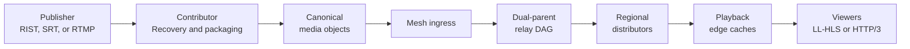
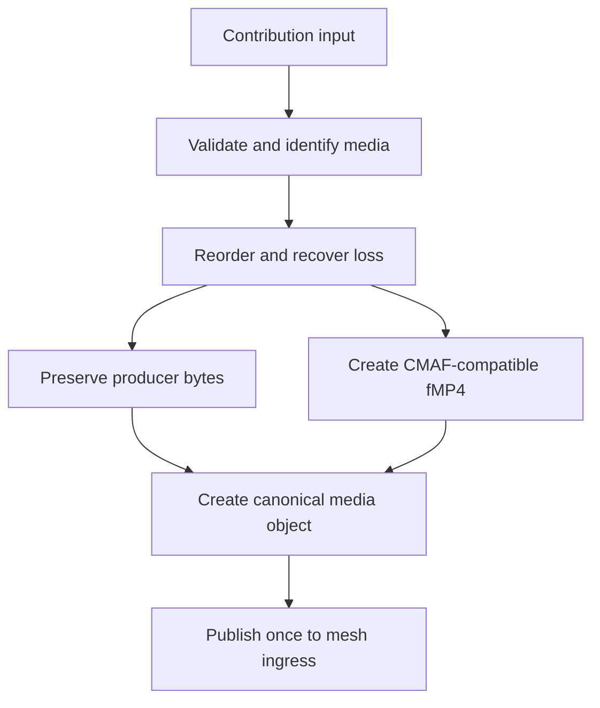
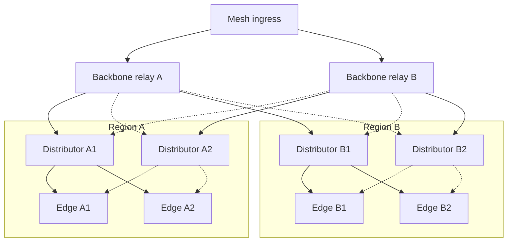
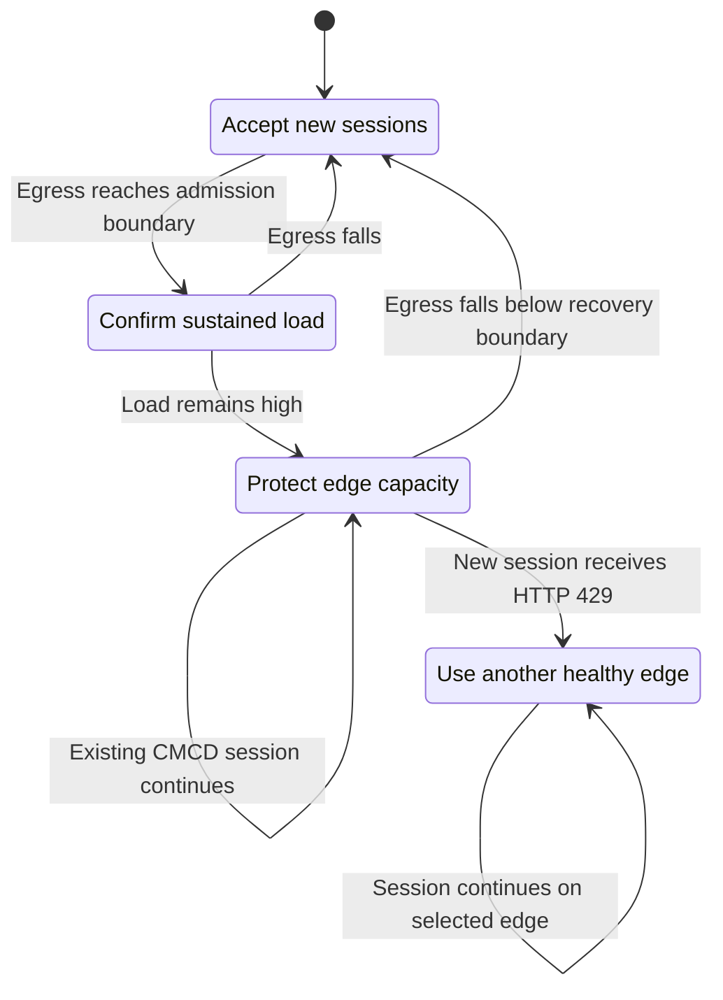
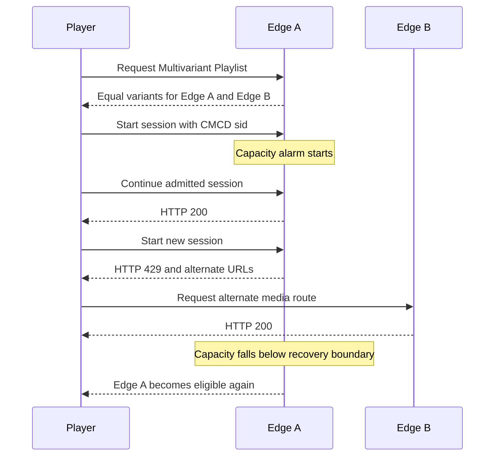
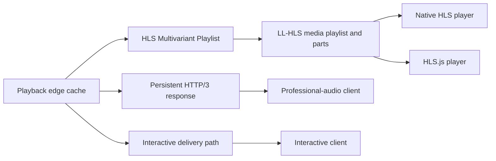
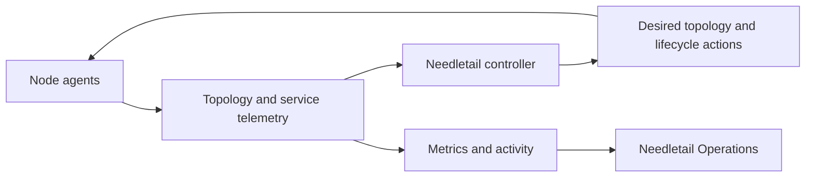

<p align="center">
  
</p>

# Needletail

Needletail is a real-time distribution mesh for live video and professional audio.
It moves each stream from contribution to global playback with fast recovery, predictable fanout, and stable edge delivery.

Needletail packages source-dependent media work once.
It then sends canonical media objects through an adaptive dual-parent DAG and regional cache tiers.
Needletail provides fast, standards-compliant LL-HLS for supported native media.
These streams work in supported native HLS players without HLS.js.

## Scale any media or bounded data on one horizontal mesh

Needletail separates format-specific packaging from distribution.
Its edges cache and deliver byte-exact payloads from any media source.
Clients receive packaged media or producer-native data through the same path.
Regional distributors and edges scale horizontally on CDN-like infrastructure.
The object model can extend this distribution architecture to any bounded data payload.

When an edge reaches capacity, active sessions remain stable.
New sessions move to healthy same-region edges, and recovered capacity returns automatically.

## What Needletail can do

| Capability | Needletail behavior |
| --- | --- |
| Contribution | Accept RIST, SRT, and RTMP sources near the publisher |
| Recovery | Restore packet order and recover missing data before publication |
| Media handling | Keep producer bytes intact or create CMAF-compatible fragmented MP4 |
| Distribution | Send immutable media objects through an adaptive dual-parent DAG |
| Regional delivery | Feed independent playback edges through bounded distributor tiers |
| Resilience | Use RaptorQ repair, reliable object fetch, and warm parent routes |
| Playback | Serve standards-based LL-HLS to native HLS players and HLS.js |
| Capacity protection | Keep admitted sessions and send new sessions to healthy edges |
| Operations | Show topology, routes, streams, capacity, alerts, and performance |

## Why Needletail is different

- Source recovery and packaging occur once for each stream.
- Opaque media objects carry packaged media, producer-native formats, and other bounded payloads.
- Warm secondary parents provide fast repair and route takeover.
- Horizontal distributor and edge tiers keep source fanout constant as demand grows.
- Standard HLS variants move new sessions between healthy playback edges.
- Session-aware admission keeps active playback stable during an edge-capacity alarm.

## End-to-end architecture



The contributor validates input, restores packet order, recovers loss, and packages supported media.
It publishes each ordered output once to the nearest mesh ingress.

The relay DAG carries each media object across regions.
Regional distributors retain a live window and feed independent playback edges.

Each edge verifies, caches, and serves the same canonical media objects.
This architecture separates viewer demand from the contributor.

## Contribution and media objects



`av-contrib` accepts compatible RIST, SRT, and RTMP sources.

The contributor can package supported H.264 and AAC input as CMAF-compatible fragmented MP4.
It can also preserve selected professional-audio formats in their original encoded form.

Canonical identity lets every relay and edge verify the same media unit.
The identity supports exact cache reads, repair, late join, and retained-window playback.

## Adaptive distribution mesh



Solid lines show primary object flow.
Dotted lines show warm secondary routes for repair and failover.

The controller places each node in an acyclic parent-to-child order.
Each stream uses one primary parent and can use one warm secondary parent.

The controller separates providers, zones, networks, and physical failure domains when possible.
It selects routes from measured latency, jitter, loss, queue state, and deadline behavior.

The secondary parent keeps subscriptions and object state warm.
It can supply repair symbols, fetch an immutable object, or take over the primary route.

Make-before-break changes warm a new parent before the route moves.
Regional distributors bound fanout and retain the live window.
Playback edges remain independent leaves at the end of the distribution mesh.

## Edge capacity failover and failback



Each edge measures response bytes in a bounded rolling window.
Separate admission and recovery boundaries provide stable capacity control.
Sustained high egress closes new-session admission until capacity recovers.

An admitted CMCD session continues on the busy edge.
A new or anonymous session receives HTTP `429` while the alarm is active.

The response provides a retry time and healthy alternate-edge URLs.
Managed clients can use this advice immediately.

Needletail selects healthy playback edges from the same regional DAG.
Each selected edge accepts traffic, has current telemetry, and provides a playback URL.
It orders valid edges by utilization, active readers, and node identity.

After recovery, Needletail restores the edge to new-session admission and future Multivariant Playlists.
Active sessions keep their stable routes on the selected healthy edges.
This restoration is capacity failback.

## Standards-based HLS failover



The player opens `/live/<stream-id>/master.m3u8`.
The playlist contains duplicate equal-bandwidth variants for healthy same-region edges.

A healthy playlist can contain these routes:

```text
#EXTM3U
#EXT-X-VERSION:9
#EXT-X-STREAM-INF:BANDWIDTH=4000000
stream.m3u8
#EXT-X-STREAM-INF:BANDWIDTH=4000000
https://edge-b.example/live/904/stream.m3u8
```

During a capacity alarm, each Multivariant Playlist lists healthy remote edges as equivalent variants.

These equal variants place failover inside the standard HLS playlist.
Native HLS players select the listed routes directly.
Managed clients can also use the alternate-edge response advice.

Needletail uses HLS.js for browsers that use a JavaScript HLS stack.
Each player also needs support for the encoded media format.

The design follows these specifications:

- [HLS Authoring Specification for Apple Devices](https://developer.apple.com/documentation/http-live-streaming/hls-authoring-specification-for-apple-devices/)
- [CTA-5004 Common Media Client Data](https://cta-wave.github.io/Resources/common-media-client-data--cta-5004-a.html)

## Playback paths



The Needletail Player selects native HLS or HLS.js for each supported browser.
Both modes use the same standards-based LL-HLS playlists and short media parts.

The player shows live delay, buffer state, playback progress, and the retained live window.
Viewers can rewind within that window and return to the live edge.

Persistent HTTP/3 responses support low-overhead professional-audio and opaque-media delivery.
Interactive paths use direct or short relay routes when measured performance permits.

## Control and operations



The controller owns topology, route generations, regional placement, and edge lifecycle.
Node agents apply desired state and report fresh service data.

Needletail Operations presents streams, nodes, routes, capacity, performance, alerts, and recent activity.
Operators can inspect the same state that controls route and admission decisions.

Production deployments use a durable controller, host node agents, and supervised native services.

## Proven edge-cache failover

The July 22, 2026, GCP qualification is the authoritative edge-cache record.
It used one contributor, one distributor, and two independent playback edges.

| Check | Result |
| --- | --- |
| Byte-identical replication | The distributor and both edges served the same 7,852-byte part |
| Capacity alarm | Edge A measured 125,632 bit/s against a 50,000 bit/s test boundary |
| Existing session | Edge A returned HTTP `200` during overload |
| New session | Edge A returned HTTP `429` with alternate-edge advice |
| Alternate edge | Edge B returned HTTP `200` |
| Recovery | Edge A reopened admission below the recovery boundary |
| HTTP/3 probe | 120 of 120 parts arrived in sequence and met their deadlines |
| Availability | HTTP/3 availability p99 was 91.222 ms |
| Estimated render | The model estimated end-to-end render p99 at 241.222 ms |
| Cleanup | All transient edge-cache test services stopped, and the initial cloud state returned |

The test scope covered one controlled alarm and recovery cycle at reduced limits.

Read the [qualification narrative](docs/real-world-tests/2026-07-22-gcp-edge-capacity-failover.md) for the topology, method, revisions, and limits.
Use the [JSON evidence](docs/real-world-tests/evidence/20260722T001300Z-edge-capacity-failover.json) for machine-readable results.

Other test categories remain in the [real-world evidence index](docs/real-world-tests/README.md).
The [current performance record](docs/performance/current-state-and-gaps.md) summarizes their accepted boundaries.

## Learn more

- [Regional edge-cache fabric](docs/edge-cache-fabric.md)
- [Relay fabric](docs/relay-fabric.md)
- [Contributor origin boundary](docs/contributor-origin-boundary.md)
- [Audio delivery lanes](docs/audio-delivery-lanes.md)
- [Operations telemetry](docs/operations-telemetry-transport.md)
- [Current performance record](docs/performance/current-state-and-gaps.md)
- [Real-world evidence](docs/real-world-tests/README.md)

## License

Needletail is available under the [MIT License](LICENSE).

## Technical terms

A canonical media object is a bounded, immutable media unit.
It contains stream identity, timing, dependencies, deadlines, and integrity data.

A directed acyclic graph (DAG) sets a one-way parent-to-child order for all forwarding routes.
Needletail creates a DAG for each stream and destination cohort.

A distributor is a regional cache service that feeds playback edges.
An edge is a leaf cache that serves viewers.

Fanout is the number of child nodes that receive data from one parent.

Low-Latency HTTP Live Streaming (LL-HLS) uses short media parts and blocking playlist reloads.
A Multivariant Playlist lists equivalent playback routes for one stream.

Common Media Client Data (CMCD) identifies a playback session with its `sid` field.
Needletail uses this identifier for session-aware edge admission.

RaptorQ is a forward error correction method.
Needletail uses RaptorQ symbols to recover media before its delivery deadline.
