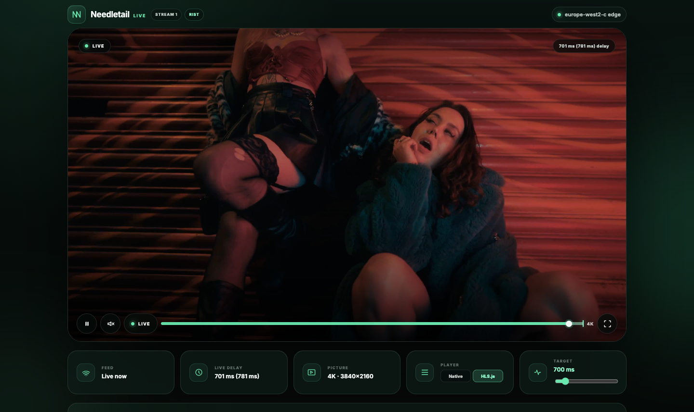
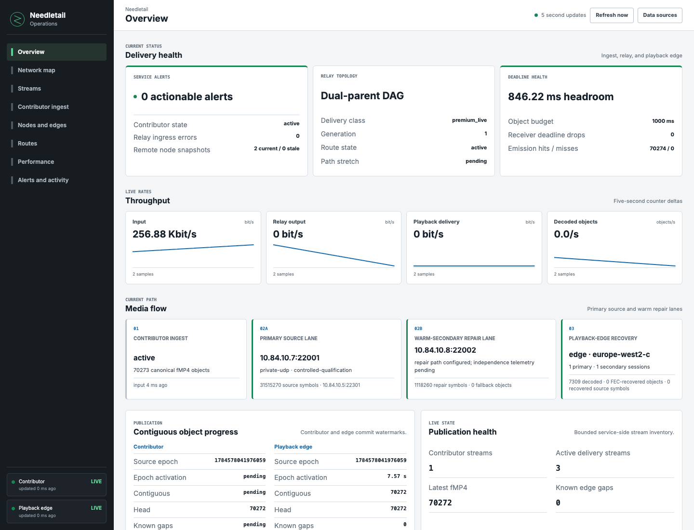

<p align="center">
  
</p>

# Needletail

Needletail is Wavey's adaptive live media delivery system for high-quality video and professional audio.
It accepts RIST, SRT, and RTMP contribution, then publishes one canonical media stream.
An adaptive dual-parent relay fabric carries that stream to regional playback edges.
Each edge serves low-latency playback and gives operators a complete view of stream health.

Needletail lets you:

- use established broadcast contribution protocols;
- recover and package each source one time;
- distribute one publication to many regions and viewers;
- adapt repair and routes to current network conditions;
- serve browser playback with Low-Latency HTTP Live Streaming (LL-HLS); and
- inspect ingest, routes, recovery, latency, and playback from one operations view.

## Ingest

Needletail accepts these contribution protocols from compatible encoders and production tools:

| Protocol | Role |
| --- | --- |
| RIST | Reliable Internet Stream Transport for resilient MPEG-TS contribution. |
| SRT | Secure Reliable Transport for resilient MPEG-TS contribution. |
| RTMP | Real-Time Messaging Protocol compatibility input for FLV publishers. |

For supported H.264/AAC input, `av-contrib` creates Common Media Application Format (CMAF) fragmented MP4 parts.
This README uses fMP4 for fragmented MP4.
RIST and SRT recover MPEG-TS before this packaging step.
RTMP supplies encoded access units through its FLV input.

`av-contrib` converts each contribution into bounded, immutable media objects.
Each object carries stream identity, timing, dependencies, and integrity data.
The relay fabric carries these canonical objects between the source, relay parents, and playback edges.
This design performs protocol recovery and packaging once near the source.

## Adaptive Delivery

Needletail uses RaptorQ forward error correction for live recovery inside the relay fabric.
It sends source symbols through the primary parent and can send compatible repair symbols through the secondary parent.

Protection changes with media importance, observed loss, jitter, queue pressure, and the remaining delivery deadline.
Reliable object fetch supplies bounded backfill when forward error correction cannot meet the deadline.
Expired work leaves the queue before it can delay newer media.

Each relay and playback edge has one primary parent and one independent warm secondary parent.
Route selection uses measured round-trip time, jitter, loss, queue state, deadlines, and failure-domain diversity.
Needletail starts a replacement route before it stops the current route.
Generation fencing prevents an old route from publishing after a route change.

Needletail adapts transport without changing encoded media bytes in the relay fabric.
This design keeps recovery responsive while preserving one canonical publication.

```text
RIST, SRT, or RTMP source
  -> contributor recovery and fMP4 packaging
  -> immutable media objects
  -> adaptive RaptorQ dual-parent relay fabric
  -> regional playback cache
  -> LL-HLS player or interactive media lane
```

## Playback

The playback edge serves same-origin LL-HLS at `/live/<stream-id>/stream.m3u8`.
Viewers open `/<stream-id>` in the Needletail Player.
The standard video path uses CMAF-compatible fMP4 parts, not MPEG-TS segments.

The player selects native HLS when the browser supports it.
Other browsers use the bundled HLS.js implementation.
A two-option control lets viewers select Native or HLS.js for conformance checks.

The live-delay slider has a range from 100 ms to 5 seconds.
The player shows the current delay and its one-second rolling average.
The timeline shows playback position, buffered ranges, and the live edge.
Viewers can seek within the retained live window.



## Operations

Needletail Operations shows the complete route from contribution to playback.
It reports active ingest protocols, stream continuity, relay parents, RaptorQ recovery, cache health, latency, and actionable alerts.

The view uses bounded status snapshots from the contributor and playback edge.
The playback edge remains the browser's single fleet data source.



## Measured Performance

Measurements completed on 20 July 2026 show low delivery overhead and useful capacity on small edge hosts.
The table gives the accepted result and its exact scope.

| Boundary | Accepted result | Scope |
| --- | --- | --- |
| Wide-area 5 ms LL-HLS | 2.390-2.452 ms additional p50 latency over raw UDP | London publication to New York, Tokyo, and Sydney clients. Browser decode and device output are excluded. |
| Persistent eight-track Opus | 128 real-time track tails per vCPU | Two-vCPU edge, 32 customers, 2,048,000 exact track units, and 12.627-12.734 ms availability p99. |
| 4K LL-HLS video | 350 concurrent viewer tails and 3.626-3.659 Gbit/s | Two repeated 60-second runs on one `n2-standard-2` edge. fMP4 part p99 was 198.95-199.05 ms. |

These results are short-window engineering baselines.
They are not endurance results or production sizing limits.
The 400-viewer video tier delivered every part, but its 222.71 ms part p99 exceeded the gate.

See [Current performance state and gaps](docs/performance/current-state-and-gaps.md) for the current boundaries.
See the [real-world test index](docs/real-world-tests/README.md) for dated methods and evidence.

## Components

Needletail is the product repository for the service constellation.
It composes, runs, observes, and validates these components:

| Component | Responsibility |
| --- | --- |
| `av-contrib` | Accept contribution protocols, recover input, package supported media, and publish canonical objects. |
| `media-object` | Define immutable object identity, integrity, dependencies, deadlines, and timestamps. |
| `raptor-fec` | Select RaptorQ geometry, protection, repair scheduling, and fetch decisions. |
| `relay-session` | Authenticate carriers, manage subscriptions, send symbols, and fetch missing objects. |
| `av-mesh` | Relay media, maintain regional caches, serve LL-HLS, and publish telemetry. |
| `playlists` | Maintain bounded media and manifest caches with generation-safe writes. |
| `mission-control` | Present ingest, topology, recovery, latency, health, and alerts. |
| `player` | Play live streams and expose latency, buffer, live-edge, and conformance controls. |

## Run Locally

Place Needletail beside its component repositories:

```text
wavey.ai/
  needletail/
  av-contrib/
  av-mesh/
  av-service/
  media-object/
  relay-session/
  playlists/
  raptor-fec/
  tls/
```

Start two playback edges and one contribution service:

```sh
make local
```

Use the fast target after you build the service binaries and web assets:

```sh
make local-fast
```

The supervisor prints the local RIST, SRT, RTMP, player, and operations addresses.

Validate the workspace:

```sh
make fmt
make check
make test
make player-check
make mission-control-check
```

Use published crates in Cargo manifests.
Do not add local `path` dependencies.

## Documentation

- [Relay fabric](docs/relay-fabric.md)
- [Contributor origin boundary](docs/contributor-origin-boundary.md)
- [Audio delivery lanes](docs/audio-delivery-lanes.md)
- [Operations telemetry transport](docs/operations-telemetry-transport.md)
- [Current performance state and gaps](docs/performance/current-state-and-gaps.md)
- [Real-world evidence](docs/real-world-tests/README.md)

## License

Needletail is available under the [MIT License](LICENSE).
