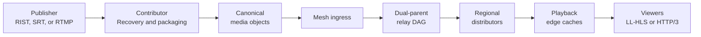
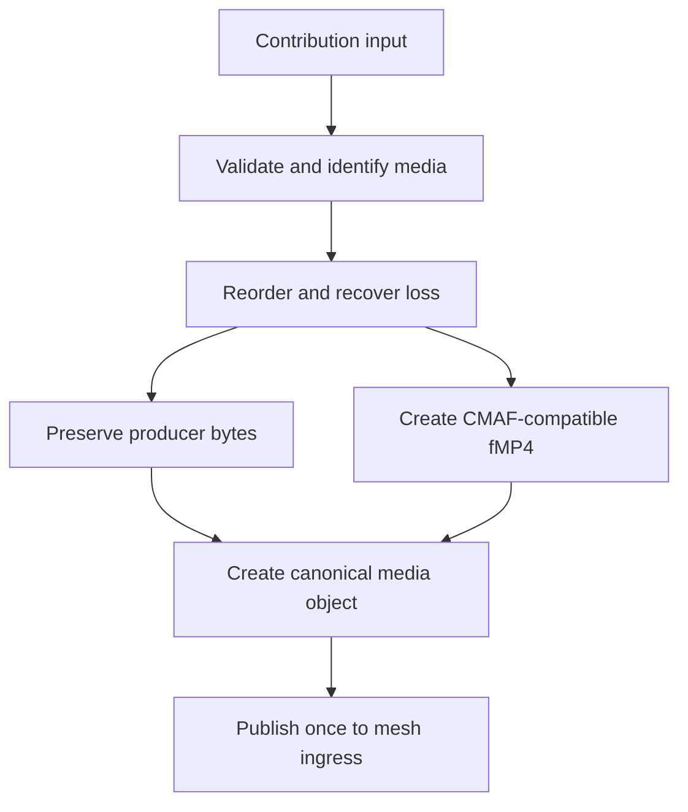
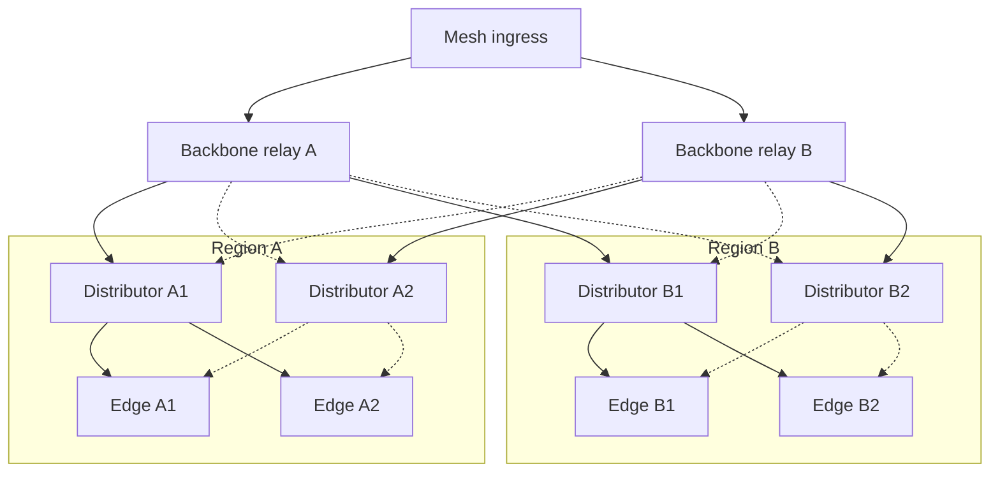
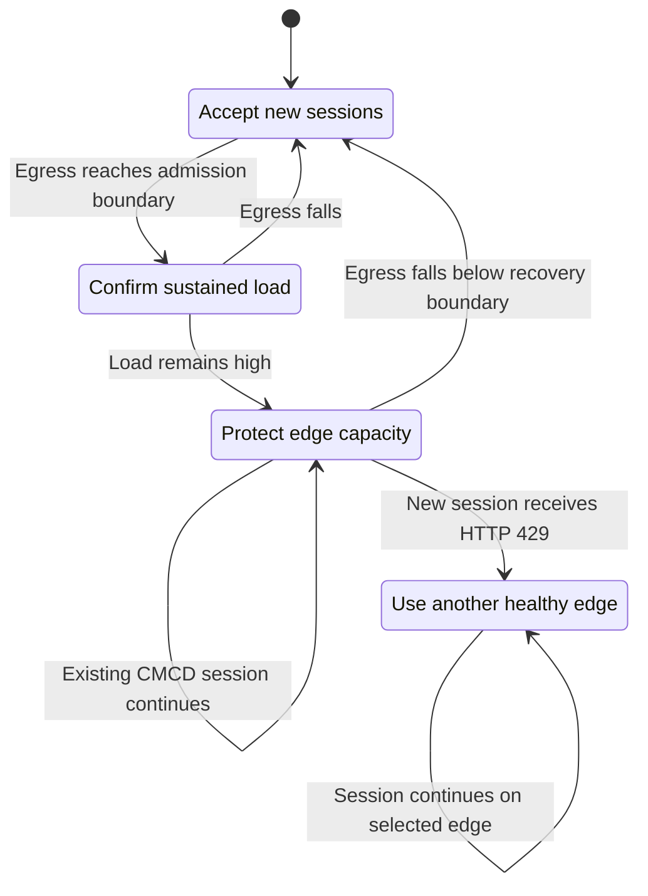
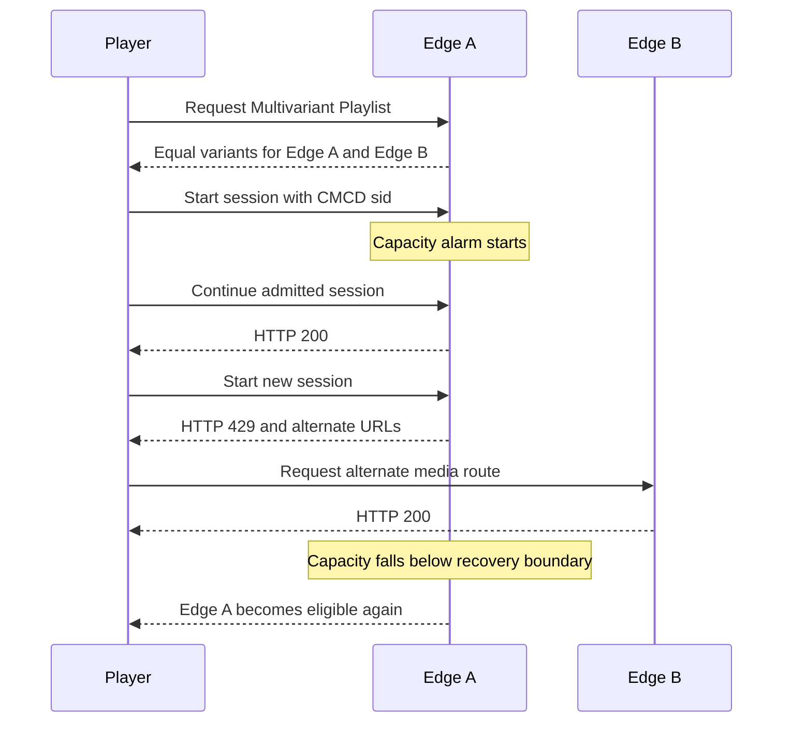
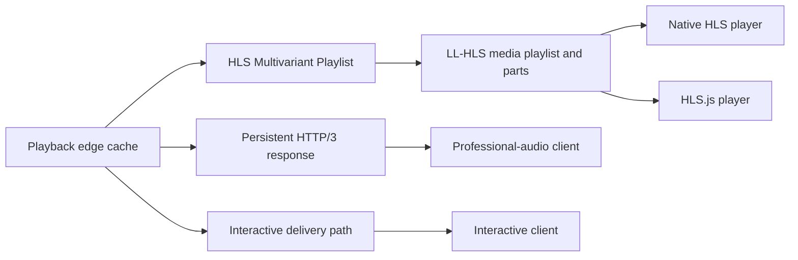
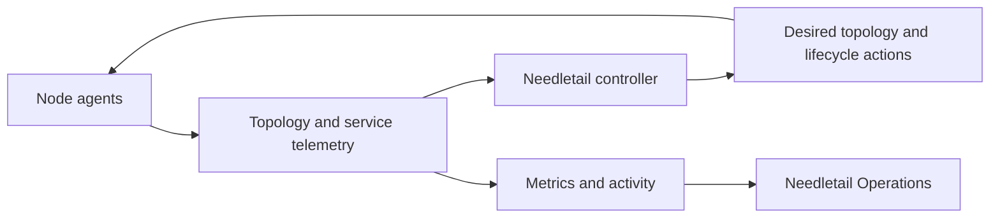

<p align="center">
  
</p>

# Needletail

Needletail moves live video and professional audio from contribution sources to viewers.
It combines contribution recovery, canonical media objects, dual-parent routing, regional edge caches, standards-based playback, and service operations.

The design keeps source work constant while regions, edges, and viewer counts increase.
It also keeps active playback sessions stable when an edge reaches its capacity boundary.
Needletail provides fast, standards-compliant LL-HLS for media that supported native players can decode.

## What Needletail can do

| Capability | Needletail behavior |
| --- | --- |
| Contribution | Accept RIST, SRT, and RTMP sources near the publisher |
| Recovery | Reorder input and recover missing data before publication |
| Media handling | Preserve producer bytes or create CMAF-compatible fragmented MP4 |
| Distribution | Send immutable media objects through an adaptive dual-parent DAG |
| Regional delivery | Feed independent playback edges through bounded distributor tiers |
| Resilience | Use RaptorQ repair, reliable object fetch, and warm parent routes |
| Playback | Serve standards-based LL-HLS to native HLS players and HLS.js |
| Capacity protection | Keep admitted sessions and send new sessions to healthy edges |
| Operations | Present topology, routes, streams, capacity, alerts, and performance |

These design choices work together:

- The contributor performs source-dependent work once for each stream.
- The mesh distributes immutable objects instead of repeating source work.
- Each playback edge is a leaf, so viewer growth does not increase origin fanout.
- HLS failover uses standard playlist variants instead of media redirects.
- Supported native HLS players use the LL-HLS stream without HLS.js.

## End-to-end architecture



The contributor validates input, restores order, recovers loss, and packages supported media.
It publishes each ordered output once to the nearest mesh ingress.

The relay DAG performs geographical fanout.
Regional distributors retain warm objects and feed independent playback edges.

Each edge verifies, caches, and publishes the same canonical objects.
The edge serves viewers without a direct contributor connection.

## Contribution and media objects



`av-contrib` accepts compatible RIST, SRT, and RTMP contribution.
RIST means Reliable Internet Stream Transport.
SRT means Secure Reliable Transport.
RTMP means Real-Time Messaging Protocol.

The contributor can package supported H.264 and AAC input as CMAF-compatible fragmented MP4.
It can also preserve selected professional-audio formats without a compatibility encode.

Canonical identity lets every relay and edge verify the same media unit.
The identity also supports exact cache reads, repair, late join, and retained-window playback.

## Adaptive distribution mesh



Solid lines show primary object flow.
Dotted lines show warm secondary routes for repair and failover.

Each stream graph has one primary parent and at most one secondary parent.
Parents always occur at an earlier DAG level than their children.

The controller selects different providers, zones, networks, or physical failure domains when possible.
It uses measured latency, jitter, loss, queue state, and deadline behavior for route selection.

The secondary parent keeps subscriptions and object state warm.
It can supply repair symbols, an immutable object fetch, or an immediate primary takeover.

Make-before-break route changes warm the new parent before the old parent closes.
Generation fencing keeps topology changes in order.

Distributors bound regional fanout and retain a live window.
Edges never feed other edges and never become regional replication hubs.

## Edge capacity failover and failback



Each edge measures response bytes in a bounded rolling window.
The service default declares 4 Gbit/s of edge capacity.

Admission closes at 85 percent after three seconds of sustained load.
Admission opens again when egress falls below 75 percent.
The default rolling window is ten seconds.

An admitted CMCD session continues on the busy edge.
A new or anonymous session receives HTTP `429` while the alarm is active.

The response includes these advisory headers:

```text
Retry-After: 1
Link: <alternate-media-url>; rel="alternate"
X-Needletail-Alternate-Edges: <alternate-media-url>
Access-Control-Expose-Headers: Link, Retry-After, X-Needletail-Alternate-Edges
```

Needletail selects alternate edges from the same regional DAG.
It excludes stale, draining, unhealthy, and overloaded edges.

The selection also excludes distributors and nodes without a playback URL.
It orders valid edges by utilization, active readers, and node identity.

Needletail does not force an active session back after recovery.
It restores the recovered edge to new-session admission and future Multivariant Playlists.

This restoration is capacity failback.
It makes the recovered edge eligible without moving sessions from a healthy alternate edge.

## Standards-based HLS failover



The player opens `/live/<stream-id>/master.m3u8`.
The playlist contains duplicate equal-bandwidth variants for healthy same-region edges.

A healthy playlist can contain these routes:

```text
#EXTM3U
#EXT-X-VERSION:9
#EXT-X-STREAM-INF:BANDWIDTH=4000000
stream.m3u8
#EXT-X-STREAM-INF:BANDWIDTH=4000000
https://edge-b.example/live/904/stream.m3u8
```

The edge omits itself from each Multivariant Playlist while its alarm is active.
Healthy remote edges remain as equivalent variants.

Needletail does not redirect HLS media requests.
The duplicate variants provide the standards-based failover route.
The playlist and failover tags comply with the linked HLS specification.

Supported native HLS players can open the Multivariant Playlist directly.
They do not require HLS.js.

The standards-based HLS failover route uses the listed variants.
This route does not depend on HLS.js or the advisory headers.

Needletail can use HLS.js when a supported browser does not provide native HLS.
The encoded media must also use a codec that the selected player supports.

The design follows these specifications:

- [HLS Authoring Specification for Apple Devices](https://developer.apple.com/documentation/http-live-streaming/hls-authoring-specification-for-apple-devices/)
- [CTA-5004 Common Media Client Data](https://cta-wave.github.io/Resources/common-media-client-data--cta-5004-a.html)

## Playback paths



The Needletail Player starts native HLS when the browser supports it.
It starts HLS.js on other supported browsers.

Both modes use the same standards-based LL-HLS playlists and short media parts.

The qualified HTTP/3 path had 91.222 ms availability p99.
Its estimated render p99 was 241.222 ms.

The player shows live delay, buffer state, playback progress, and the retained live window.
Viewers can rewind within that window and return to the live edge.

Persistent HTTP/3 responses support low-overhead professional-audio delivery.
Interactive paths can use direct or short relay routes when measured performance permits.

## Control and operations



The controller owns topology, route generations, regional placement, and edge lifecycle.
Node agents apply desired state and report fresh service data.

Needletail Operations presents streams, nodes, routes, capacity, performance, alerts, and recent activity.
Operators can inspect the same state that controls route and admission decisions.

Production uses the durable controller, node agents, and `systemd`-supervised native services.
The Rust supervisor supports local development and qualification.

## Proven edge-cache failover

The July 22 GCP qualification is the authoritative edge-cache record.
It used one contributor, one distributor, and two independent playback edges.

| Check | Result |
| --- | --- |
| Byte-identical replication | The distributor and both edges served the same 7,852-byte part |
| Capacity alarm | Edge A measured 125,632 bit/s against a 50,000 bit/s test boundary |
| Existing session | Edge A returned HTTP `200` during overload |
| New session | Edge A returned HTTP `429` with alternate-edge advice |
| Alternate edge | Edge B returned HTTP `200` |
| Recovery | Edge A reopened admission below the recovery boundary |
| HTTP/3 probe | 120 of 120 parts arrived without gaps or deadline misses |
| Availability | HTTP/3 availability p99 was 91.222 ms |
| Estimated render | The model estimated end-to-end render p99 at 241.222 ms |
| Cleanup | All transient services stopped and the initial cloud state returned |

The test used reduced limits to produce one controlled alarm and recovery cycle.
It did not measure maximum edge throughput or long-duration session churn.

Read the [qualification narrative](docs/real-world-tests/2026-07-22-gcp-edge-capacity-failover.md) for the topology, method, revisions, and limits.
Use the [JSON evidence](docs/real-world-tests/evidence/20260722T001300Z-edge-capacity-failover.json) for machine-readable results.

Other test categories remain in the [real-world evidence index](docs/real-world-tests/README.md).
The [current performance record](docs/performance/current-state-and-gaps.md) summarizes their accepted boundaries.

## Learn more

- [Regional edge-cache fabric](docs/edge-cache-fabric.md)
- [Relay fabric](docs/relay-fabric.md)
- [Contributor origin boundary](docs/contributor-origin-boundary.md)
- [Audio delivery lanes](docs/audio-delivery-lanes.md)
- [Operations telemetry](docs/operations-telemetry-transport.md)
- [Current performance record](docs/performance/current-state-and-gaps.md)
- [Real-world evidence](docs/real-world-tests/README.md)

## License

Needletail is available under the [MIT License](LICENSE).

## Technical terms

A canonical media object is a bounded, immutable media unit.
It contains stream identity, timing, dependencies, deadlines, and integrity data.

A directed acyclic graph (DAG) is a forwarding graph without routing loops.
Needletail creates a DAG for each stream and destination cohort.

A distributor is a regional cache service that feeds playback edges.
An edge is a leaf cache that serves viewers.

Fanout is the number of child nodes that receive data from one parent.

Low-Latency HTTP Live Streaming (LL-HLS) uses short media parts and blocking playlist reloads.
A Multivariant Playlist lists equivalent playback routes for one stream.

Common Media Client Data (CMCD) identifies a playback session with its `sid` field.
Needletail uses this identifier for session-aware edge admission.

RaptorQ is a forward error correction method.
Needletail uses RaptorQ symbols to recover media before its delivery deadline.
