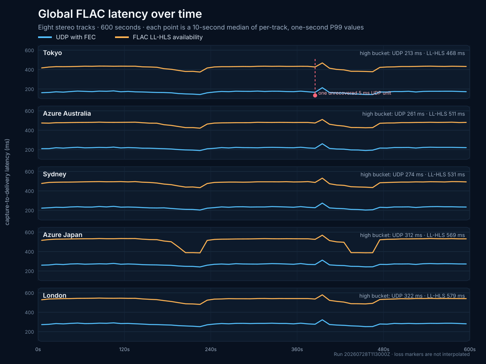
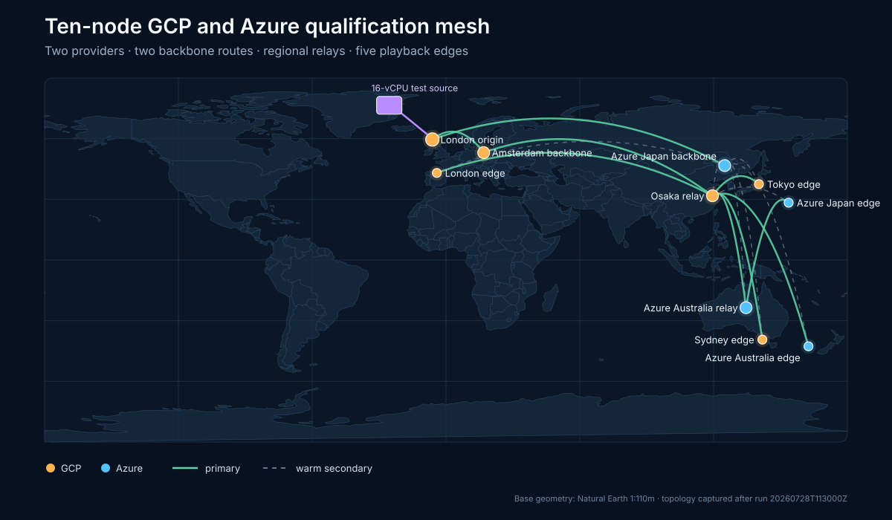
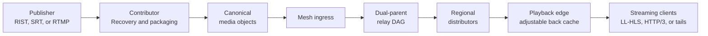
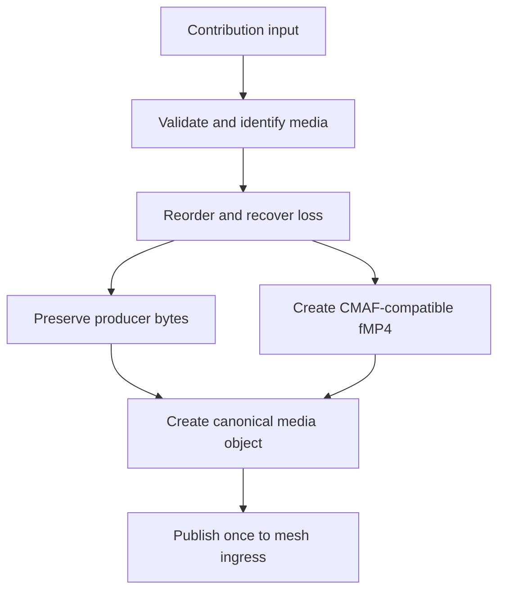
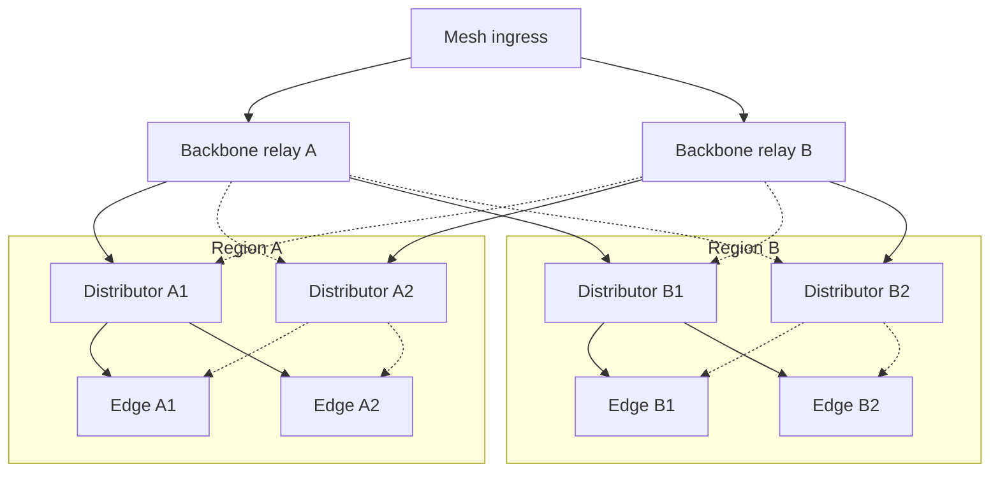
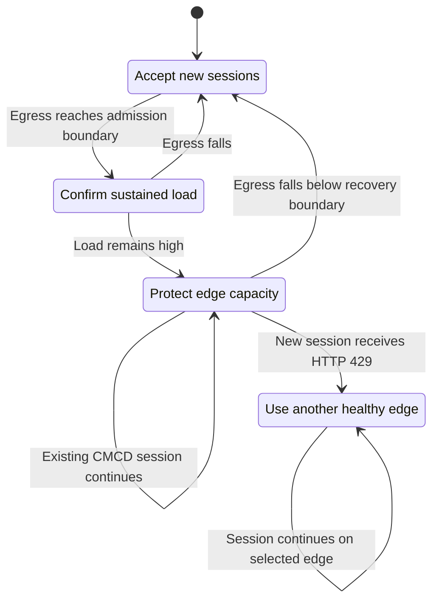
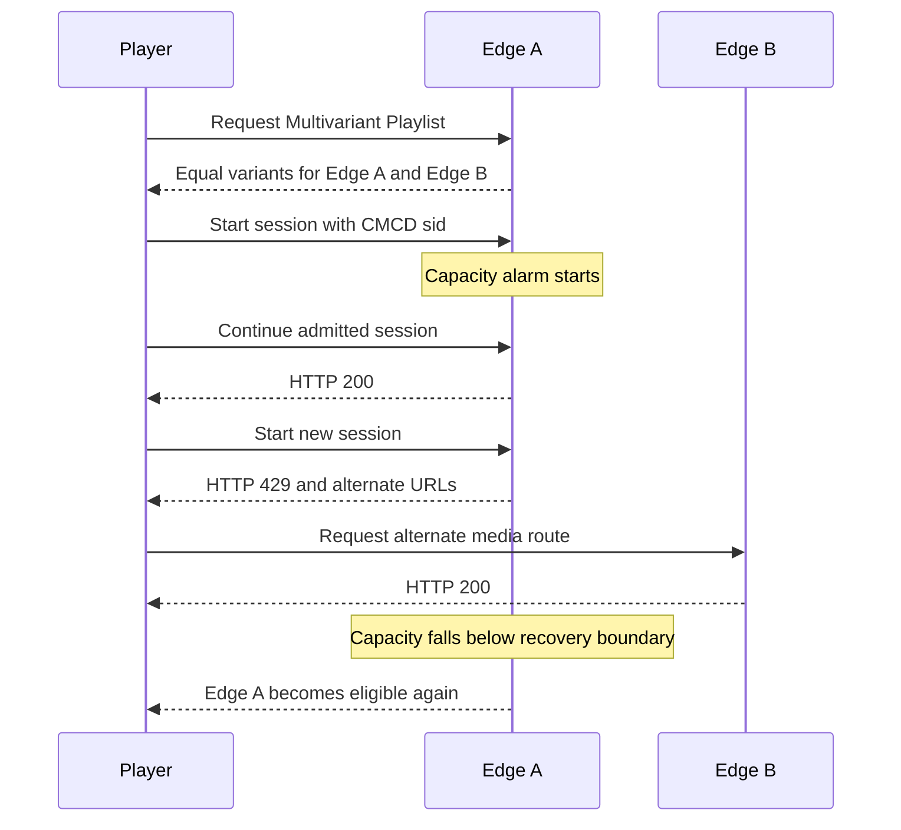
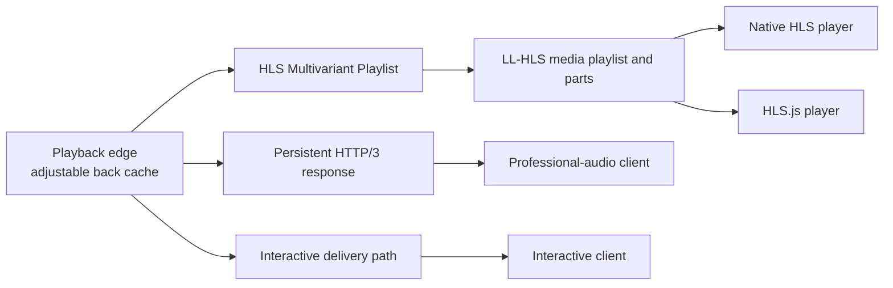
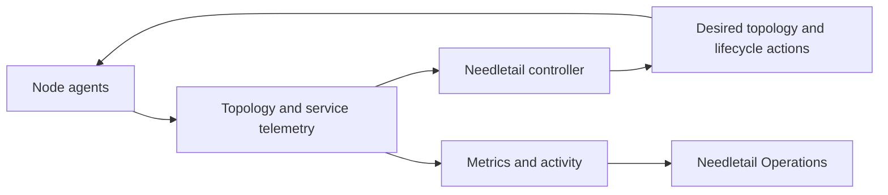

<p align="center">
  
</p>

# Needletail

Needletail is a real-time distribution mesh for live video and professional audio.
It moves each stream from contribution to global playback with fast recovery, predictable fanout, and stable edge delivery.

Needletail packages source-dependent media work once.
It then sends canonical media objects through an adaptive dual-parent DAG and regional cache tiers.
Needletail provides fast, standards-compliant LL-HLS for supported native media.
These streams work in supported native HLS players without HLS.js.

## Scale any streaming data on one horizontal mesh

Needletail separates format-specific packaging from distribution.
Its edges cache and deliver byte-exact payloads from any streaming source.
Clients receive packaged media or producer-native streaming data through the same path.
Regional distributors and edges scale horizontally on CDN-like infrastructure.
The object model can extend this distribution architecture to other continuous data streams.

Each playback edge keeps the newest parts in an adjustable back cache.
A tail request reads cached parts immediately and waits only for the next available part.
Operators tune back-cache depth by part count and choose blocking response duration separately.

When an edge reaches capacity, active sessions remain stable.
New sessions move to healthy same-region edges, and recovered capacity returns automatically.

## What Needletail can do

| Capability | Needletail behavior |
| --- | --- |
| Contribution | Accept RIST, SRT, and RTMP sources near the publisher |
| Recovery | Restore packet order and recover missing data before publication |
| Media handling | Keep producer bytes intact or create CMAF-compatible fragmented MP4 |
| Distribution | Send immutable media objects through an adaptive dual-parent DAG |
| Regional delivery | Feed independent playback edges through bounded distributor tiers |
| Resilience | Use RaptorQ repair, reliable object fetch, and warm parent routes |
| Streaming delivery | Serve standards-based LL-HLS to native HLS players and HLS.js |
| Capacity protection | Keep admitted sessions and send new sessions to healthy edges |
| Operations | Show topology, routes, streams, capacity, alerts, and performance |

## Why Needletail is different

- Source recovery and packaging occur once for each stream.
- Opaque media objects carry packaged media, producer-native formats, and other streaming payloads.
- Warm secondary parents provide fast repair and route takeover.
- Horizontal distributor and edge tiers keep source fanout constant as demand grows.
- Standard HLS variants move new sessions between healthy playback edges.
- Session-aware admission keeps active playback stable during an edge-capacity alarm.

## Measured global multitrack performance

The July 28, 2026, test used ten Needletail nodes across GCP and Azure.
It sent eight independent stereo tracks from London for 600 seconds.
Each lossless FLAC stream also included an Opus companion stream.
Five playback edges measured UDP with FEC and FLAC LL-HLS from the same source clock.

The source emitted 960,000 encoded track packets with zero send errors.
It also reported zero dropped frames.
Source process capacity P99 was 4.44 percent of the 16-vCPU host.
The contributor completed all 1,920,000 expected audio groups and recovered seven lost source fragments.

The UDP lane delivered 4,799,996 of 4,800,000 measured edge-track epochs.
Four tracks missed one shared 5 ms epoch at the Tokyo edge.
The measured UDP loss was 0.000083 percent.
All other UDP edge-track lanes were complete.

For the UDP lane alone, this is acceptable loss.
UDP with FEC trades absolute delivery for bounded latency.
More mesh-to-edge recovery symbols could reduce the remaining loss probability.
No UDP or FEC setting can guarantee delivery.
An acknowledged FLAC repair path must fill an omission before final rendering.
Needletail does not claim lossless rendered output until that recovery gate passes.

| Edge | UDP P50 range | UDP P99 range | FLAC LL-HLS P50 range | FLAC LL-HLS P99 range |
| --- | ---: | ---: | ---: | ---: |
| Tokyo | 137.279-138.600 ms | 184.654-186.796 ms | 142.381-172.071 ms | 183.740-219.819 ms |
| Azure Australia | 185.383-186.604 ms | 230.584-232.631 ms | 190.776-219.769 ms | 231.140-274.841 ms |
| Sydney | 197.246-198.567 ms | 244.837-247.089 ms | 202.772-232.262 ms | 244.337-281.712 ms |
| Azure Japan | 235.797-237.062 ms | 281.725-283.864 ms | 241.948-270.930 ms | 283.231-319.623 ms |
| London | 246.005-247.352 ms | 293.785-295.921 ms | 251.308-280.948 ms | 293.052-326.113 ms |



The chart uses ten-second medians.
Each input point is a one-second P99 value for one track.
The LL-HLS values measure delivery after the final sample in each part.
They exclude the 250 ms part duration for a fair mesh delivery comparison.
Playback latency also includes media accumulation and the player buffer.
The UDP result includes the one unrecovered Tokyo epoch at source second 385.



The strict combined result is `FAIL`.
The UDP gate required zero loss.
The FLAC LL-HLS probes missed 14 final-window parts across nine of 40 lanes.
They also recorded 87 deadline misses during the first three seconds.
Complete LL-HLS lanes contained two source-start discontinuity markers.

The run found no sustained overload, queue drop, kernel socket drop, or corrupt Opus packet.
It supports claims about demonstrated topology, latency, recovery, and source capacity.
It does not support a production SLA or a zero-loss rendered-audio claim.

Read the [detailed test record](docs/real-world-tests/2026-07-28-global-multitrack-audio.md).
Use the [machine-readable evidence](docs/real-world-tests/evidence/20260728T113000Z-linode16-8track-recovery20-combined.json) for exact totals and limits.

## End-to-end architecture


```mermaid
flowchart LR
    P["Publisher<br/>RIST, SRT, or RTMP"]
    C["Contributor<br/>Recovery and packaging"]
    O["Canonical<br/>media objects"]
    I["Mesh ingress"]
    R["Dual-parent<br/>relay DAG"]
    D["Regional<br/>distributors"]
    E["Playback edge<br/>adjustable back cache"]
    V["Streaming clients<br/>LL-HLS, HTTP/3, or tails"]

    P --> C
    C --> O
    O --> I
    I --> R
    R --> D
    D --> E
    E --> V
```

The contributor validates input, restores packet order, recovers loss, and packages supported media.
It publishes each ordered output once to the nearest mesh ingress.

The relay DAG carries each media object across regions.
Regional distributors retain a live window and feed independent playback edges.

Each edge verifies, caches, and serves the same canonical media objects.
This architecture separates viewer demand from the contributor.

## Contribution and media objects


```mermaid
flowchart TD
    IN["Contribution input"]
    CHECK["Validate and identify media"]
    RECOVER["Reorder and recover loss"]
    PRESERVE["Preserve producer bytes"]
    PACKAGE["Create CMAF-compatible fMP4"]
    OBJECT["Create canonical media object"]
    PUBLISH["Publish once to mesh ingress"]

    IN --> CHECK
    CHECK --> RECOVER
    RECOVER --> PRESERVE
    RECOVER --> PACKAGE
    PRESERVE --> OBJECT
    PACKAGE --> OBJECT
    OBJECT --> PUBLISH
```

`av-contrib` accepts compatible RIST, SRT, and RTMP sources.

The contributor can package supported H.264 and AAC input as CMAF-compatible fragmented MP4.
It can also preserve selected professional-audio formats in their original encoded form.

Canonical identity lets every relay and edge verify the same media unit.
The identity supports exact cache reads, repair, late join, and retained-window playback.

## Adaptive distribution mesh


```mermaid
flowchart TB
    I["Mesh ingress"]
    B1["Backbone relay A"]
    B2["Backbone relay B"]

    subgraph RA["Region A"]
        DA1["Distributor A1"]
        DA2["Distributor A2"]
        EA1["Edge A1"]
        EA2["Edge A2"]
    end

    subgraph RB["Region B"]
        DB1["Distributor B1"]
        DB2["Distributor B2"]
        EB1["Edge B1"]
        EB2["Edge B2"]
    end

    I --> B1
    I --> B2

    B1 --> DA1
    B2 -.-> DA1
    B2 --> DA2
    B1 -.-> DA2
    B1 --> DB1
    B2 -.-> DB1
    B2 --> DB2
    B1 -.-> DB2

    DA1 --> EA1
    DA1 --> EA2
    DA2 -.-> EA1
    DA2 -.-> EA2

    DB1 --> EB1
    DB1 --> EB2
    DB2 -.-> EB1
    DB2 -.-> EB2
```

Solid lines show primary object flow.
Dotted lines show warm secondary routes for repair and failover.

The controller places each node in an acyclic parent-to-child order.
Each stream uses one primary parent and can use one warm secondary parent.

The controller separates providers, zones, networks, and physical failure domains when possible.
It selects routes from measured latency, jitter, loss, queue state, and deadline behavior.

The secondary parent keeps subscriptions and object state warm.
It can supply repair symbols, fetch an immutable object, or take over the primary route.

Make-before-break changes warm a new parent before the route moves.
Regional distributors bound fanout and retain the live window.
Playback edges remain independent leaves at the end of the distribution mesh.

## Edge capacity failover and failback


```mermaid
stateDiagram-v2
    state "Accept new sessions" as Accepting
    state "Confirm sustained load" as Observing
    state "Protect edge capacity" as Protecting
    state "Use another healthy edge" as Alternate

    [*] --> Accepting
    Accepting --> Observing: Egress reaches admission boundary
    Observing --> Accepting: Egress falls
    Observing --> Protecting: Load remains high
    Protecting --> Protecting: Existing CMCD session continues
    Protecting --> Alternate: New session receives HTTP 429
    Protecting --> Accepting: Egress falls below recovery boundary
    Alternate --> Alternate: Session continues on selected edge
```

Each edge measures response bytes in a bounded rolling window.
Separate admission and recovery boundaries provide stable capacity control.
Sustained high egress closes new-session admission until capacity recovers.

An admitted CMCD session continues on the busy edge.
A new or anonymous session receives HTTP `429` while the alarm is active.

The response provides a retry time and healthy alternate-edge URLs.
Managed clients can use this advice immediately.

Needletail selects healthy playback edges from the same regional DAG.
Each selected edge accepts traffic, has current telemetry, and provides a playback URL.
It orders valid edges by utilization, active readers, and node identity.

After recovery, Needletail restores the edge to new-session admission and future Multivariant Playlists.
Active sessions keep their stable routes on the selected healthy edges.
This restoration is capacity failback.

## Standards-based HLS failover


```mermaid
sequenceDiagram
    participant Player
    participant EdgeA as Edge A
    participant EdgeB as Edge B

    Player->>EdgeA: Request Multivariant Playlist
    EdgeA-->>Player: Equal variants for Edge A and Edge B
    Player->>EdgeA: Start session with CMCD sid
    Note over EdgeA: Capacity alarm starts
    Player->>EdgeA: Continue admitted session
    EdgeA-->>Player: HTTP 200
    Player->>EdgeA: Start new session
    EdgeA-->>Player: HTTP 429 and alternate URLs
    Player->>EdgeB: Request alternate media route
    EdgeB-->>Player: HTTP 200
    Note over EdgeA: Capacity falls below recovery boundary
    EdgeA-->>Player: Edge A becomes eligible again
```

The player opens `/live/<stream-id>/master.m3u8`.
The playlist contains duplicate equal-bandwidth variants for healthy same-region edges.

A healthy playlist can contain these routes:

```text
#EXTM3U
#EXT-X-VERSION:9
#EXT-X-STREAM-INF:BANDWIDTH=4000000
stream.m3u8
#EXT-X-STREAM-INF:BANDWIDTH=4000000
https://edge-b.example/live/904/stream.m3u8
```

During a capacity alarm, each Multivariant Playlist lists healthy remote edges as equivalent variants.

These equal variants place failover inside the standard HLS playlist.
Native HLS players select the listed routes directly.
Managed clients can also use the alternate-edge response advice.

Needletail uses HLS.js for browsers that use a JavaScript HLS stack.
Each player also needs support for the encoded media format.

The design follows these specifications:

- [HLS Authoring Specification for Apple Devices](https://developer.apple.com/documentation/http-live-streaming/hls-authoring-specification-for-apple-devices/)
- [CTA-5004 Common Media Client Data](https://cta-wave.github.io/Resources/common-media-client-data--cta-5004-a.html)

## Playback paths


```mermaid
flowchart LR
    EDGE["Playback edge<br/>adjustable back cache"]
    MASTER["HLS Multivariant Playlist"]
    MEDIA["LL-HLS media playlist and parts"]
    NATIVE["Native HLS player"]
    HLSJS["HLS.js player"]
    H3["Persistent HTTP/3 response"]
    AUDIO["Professional-audio client"]
    INTERACTIVE["Interactive delivery path"]
    CLIENT["Interactive client"]

    EDGE --> MASTER
    MASTER --> MEDIA
    MEDIA --> NATIVE
    MEDIA --> HLSJS
    EDGE --> H3
    H3 --> AUDIO
    EDGE --> INTERACTIVE
    INTERACTIVE --> CLIENT
```

The Needletail Player selects native HLS or HLS.js for each supported browser.
Both modes use the same standards-based LL-HLS playlists and short media parts.

A tail request reads recent parts from the back cache and blocks for the next part.
Operators can expand the back cache for late join, rewind, and recovery.

The player shows live delay, buffer state, playback progress, and the retained live window.
Viewers can rewind within that window and return to the live edge.

Persistent HTTP/3 responses support low-overhead professional-audio and opaque-media delivery.
Interactive paths use direct or short relay routes when measured performance permits.

## Control and operations


```mermaid
flowchart LR
    AGENTS["Node agents"]
    TELEMETRY["Topology and service telemetry"]
    CONTROLLER["Needletail controller"]
    DESIRED["Desired topology and lifecycle actions"]
    METRICS["Metrics and activity"]
    OPS["Needletail Operations"]

    AGENTS --> TELEMETRY
    TELEMETRY --> CONTROLLER
    CONTROLLER --> DESIRED
    DESIRED --> AGENTS
    TELEMETRY --> METRICS
    METRICS --> OPS
```

The controller owns topology, route generations, regional placement, and edge lifecycle.
Node agents apply desired state and report fresh service data.

Needletail Operations presents streams, nodes, routes, capacity, performance, alerts, and recent activity.
Operators can inspect the same state that controls route and admission decisions.

Production deployments use a durable controller, host node agents, and supervised native services.

## Learn more

- [Regional edge-cache fabric](docs/edge-cache-fabric.md)
- [Relay fabric](docs/relay-fabric.md)
- [Contributor origin boundary](docs/contributor-origin-boundary.md)
- [Audio delivery lanes](docs/audio-delivery-lanes.md)
- [Operations telemetry](docs/operations-telemetry-transport.md)
- [Global multitrack test record](docs/real-world-tests/2026-07-28-global-multitrack-audio.md)
- [Real-world evidence](docs/real-world-tests/README.md)

## License

Needletail is available under the [MIT License](LICENSE).

## Technical terms

A canonical media object is a bounded, immutable media unit.
It contains stream identity, timing, dependencies, deadlines, and integrity data.

A directed acyclic graph (DAG) sets a one-way parent-to-child order for all forwarding routes.
Needletail creates a DAG for each stream and destination cohort.

A distributor is a regional cache service that feeds playback edges.
An edge is a leaf cache that serves viewers.

Fanout is the number of child nodes that receive data from one parent.

Low-Latency HTTP Live Streaming (LL-HLS) uses short media parts and blocking playlist reloads.
A Multivariant Playlist lists equivalent playback routes for one stream.

Common Media Client Data (CMCD) identifies a playback session with its `sid` field.
Needletail uses this identifier for session-aware edge admission.

A streaming tail is the newest available portion of a live stream.
A back cache is an adjustable store of recent parts behind the live edge.

RaptorQ is a forward error correction method.
Needletail uses RaptorQ symbols to recover media before its delivery deadline.
