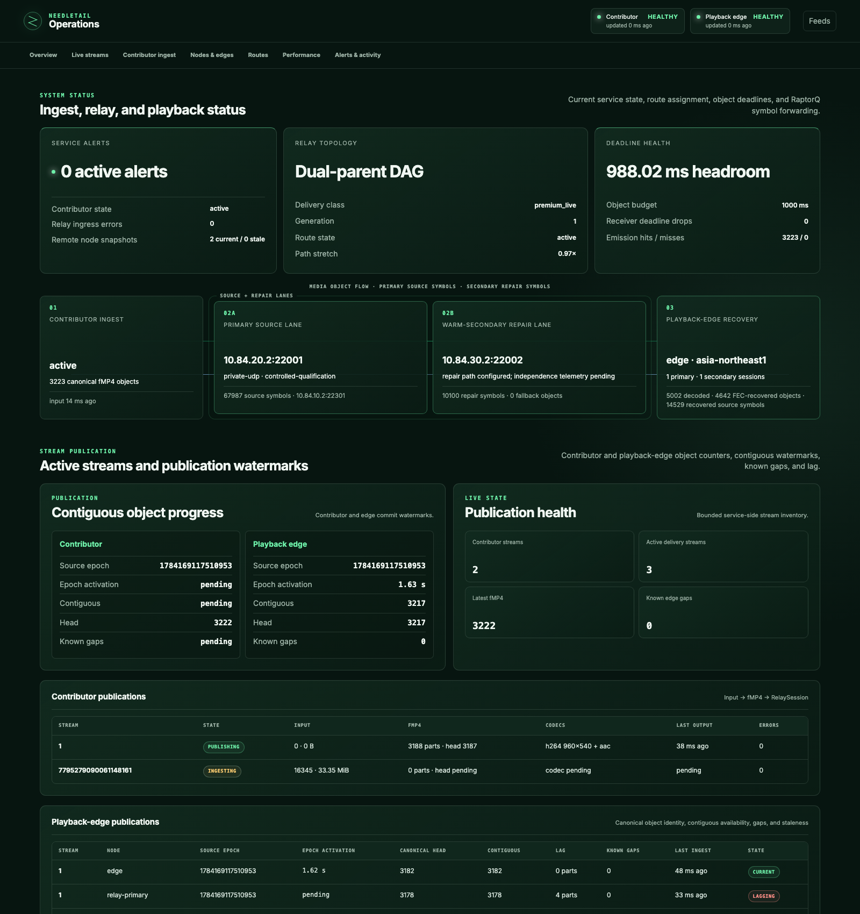
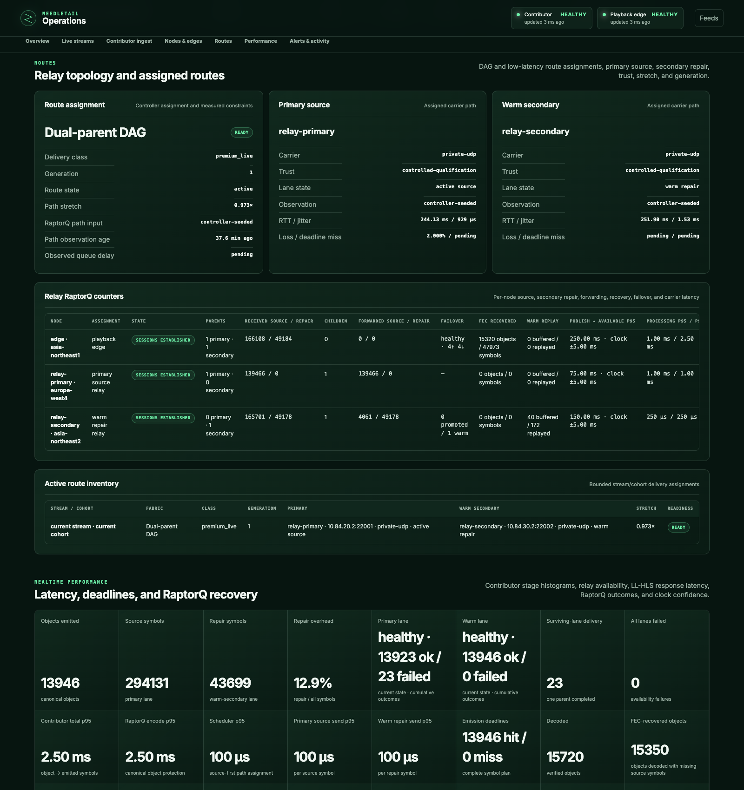
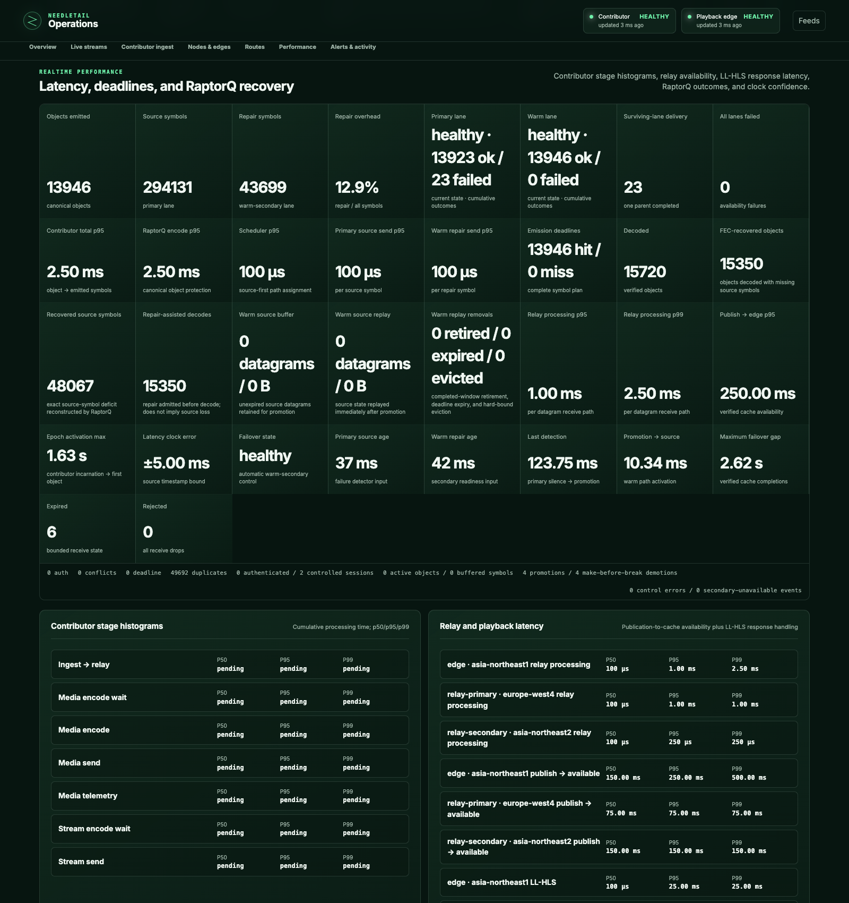

# Real-world load dashboard screenshots

Run: [`20260716T023139Z`](../real-world-tests/evidence/20260716T023139Z.json)

Topology: London contributor, Amsterdam primary relay, Osaka secondary relay,
Tokyo playback edge. Four `e2-standard-2` GCP instances.

## Gate results

| Metric | Result | Gate |
| --- | ---: | ---: |
| Primary route RTT | 244.127 ms | path stretch <= 1.15x |
| Secondary route RTT | 251.904 ms | path stretch <= 1.15x |
| Primary route stretch | 0.972947x | <= 1.15x |
| Secondary route stretch | 1.003942x | <= 1.15x |
| Failover detection | 106.940 ms | <= 250 ms |
| Promotion to source | 10.703 ms | <= 250 ms |
| Failover media gap | 120.034 ms | <= 250 ms |
| Relay processing p95 | 1.000 ms | <= 1.000 ms |
| Publication-to-cache p99 | 150.000 ms | <= 500.000 ms |
| RaptorQ recovered objects | 381 | > 0, no drops |
| RaptorQ recovered source symbols | 1,195 | > 0, no drops |

The live dashboard screenshots are cumulative operational views. The evidence
JSON above is the pass/fail record for the gated fault run.

## Dashboard load

`h2load` against the Tokyo edge through the local SSH tunnel:

| Metric | Result |
| --- | ---: |
| Duration | 60 s |
| Connections | 8 |
| Streams per connection | 4 |
| Requests | 6,520 |
| Success | 6,520 |
| Failed / errored / timed out | 0 |
| Throughput | 108.67 req/s |
| Mean request time | 290.71 ms |
| Max request time | 976.55 ms |

Post-load API snapshot: no alerts, edge contiguous at head, rejected datagrams
`0`, deadline drops `0`. Cumulative live counters after the gate and dashboard
load showed `6` expired objects and a historical maximum failover gap of
`2.618526 s`; those counters are recorded as follow-up observations, not the
gated failover result.

## Screenshots

### Overview

### Routes

### Performance

