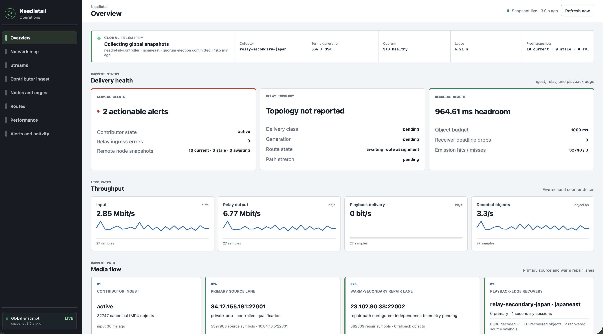

# Needletail Operations

Needletail Operations is the product operations UI. It provides
separate hash-routed views for:

- current health and throughput
- a geographic node and link map
- live streams and contiguous publication
- contributor listeners, sessions, fMP4 output, codecs, and errors
- nodes and playback-edge services
- compiled dual-parent-DAG and low-latency route assignments
- contributor and LL-HLS latency, RaptorQ recovery, deadlines, and clock
  confidence
- alerts and recent activity from both services.



This July 30 capture is from the live ten-node GCP/Azure qualification
deployment. See the root [Needletail Operations live UI](../README.md#needletail-operations-live-ui)
section for all supplied page captures, the live-player capture, and an
explanation of the state shown on each page.

The browser fetches one bounded, same-origin `/api/mesh` snapshot every five
seconds. That canonical global snapshot declares
`schema: "needletail.operations-snapshot.v1"` and embeds contributor status
under `contributor`; the browser does not poll a second service or accept
endpoint overrides. Unsupported or missing schemas are unavailable, not
silently adapted. Polling pauses while the page is hidden and each request is
aborted after four seconds. Throughput comes from monotonic counter changes,
with at most six minutes of samples retained in memory. Counter resets and
sub-second observations do not produce rate spikes.

The map uses the node coordinates already present in `/api/mesh`. When the
snapshot includes `topology_links`, it renders the complete bounded global
topology, separates primary and warm-secondary paths, and shows link health,
RTT, throughput, and generation in accessible link labels. It does not invent
links when topology is unavailable, and it omits nodes with missing or invalid
coordinates instead of placing them at `0,0`. Its local CC0 base image does not
require a map service at runtime.

The elected collector assembles one bounded, low-cardinality snapshot from:

- embedded contributor status for contributor health, RelaySession carrier
  assignments, primary source traffic, warm-secondary repair traffic, RaptorQ
  emission, deadline headroom, publication heads, and forwarding latency
- top-level mesh status for playback-edge health, RelaySession ingress,
  RaptorQ recovery, publication watermarks, and LL-HLS handler latency.

Every snapshot field uses a Serde default. A rolling component deployment can
therefore present a partial snapshot while the operations dashboard marks the
controller or telemetry fields that are still arriving. Stream, node, session,
edge, alert, and activity arrays are capped before rendering.

The `orchestration.collector` object carries the active global
collector, authority, role, Raft term, fencing generation, quorum voter counts,
lease time remaining, leadership-change context, endpoints, and current/stale/
awaiting node totals. Overview, Network map, and Nodes show this state without
assuming that the node serving the browser is the collector. Healthy state
requires a fresh snapshot, a nonzero term and generation, a majority of an odd
three-or-more-voter set, and an unexpired lease. Missing or stale proof is never
displayed as healthy.

The UI consumes only the canonical field names. Removed aliases and browser-side
delivery or topology fallbacks are intentionally not accepted. The collector
derives the single-publication summary from canonical stream rows: the freshest
head, fleet-wide contiguous floor, worst retained gap count, common source
epoch, and slowest fully reported epoch activation. It does not combine
different stream identities or partially reported fleet watermarks. For a
single contributor publication, the collector derives its current head and
continuity from the contributor's canonical fMP4 sequence. Missing historical
measurements are shown as `not measured` or `not reported`, rather than implying
that an already-active publication is still pending:

- delivery class, fabric, desired-state generation, installed route state, and
  per-stream/cohort route inventory
- primary and warm-secondary node identities, failure-domain independence,
  RTT, jitter, loss, deadline-miss rate, and path stretch
- contributor deadline hit/miss and sender-expiry totals
- incomplete or multi-stream publication watermarks and known-gap totals
- detailed RIST/SRT session RTT, jitter, loss, reconnect, and end-reason
  telemetry.

The dashboard displays only route and publication state emitted by the
collector/controller contract.

Run locally:

```sh
make serve
```

### Documentation and qualification preview

Build the current assets and serve them with the committed documentation
fixture:

```sh
make -C mission-control build
python3 mission-control/scripts/serve-documentation-preview.py
```

Open `http://127.0.0.1:5188/mesh`. The fixture is representative, not captured
production telemetry. Its `preview.label` says so, its Activity view carries a
documentation-fixture event, and its collector authority, leader, term,
fencing generation, quorum, voters, and lease are all unreported. The
Operations collector bar therefore remains unavailable by design.

To use current qualification telemetry instead, give the server the deployed
service-local endpoints:

```sh
python3 mission-control/scripts/serve-documentation-preview.py \
  --edge-snapshot https://edge.example/api/mesh \
  --contributor-snapshot https://contributor.example/api/status
```

The inputs are reloaded for each dashboard poll. This preview-only adapter adds
the canonical `needletail.operations-snapshot.v1` envelope and embeds the
contributor response. It does not synthesize publication, delivery, route, or
topology state that the inputs did not report. It always removes collector
election and lease proof, even if an input contains those fields, because it is
not a consensus-backed collector. `--insecure-upstream` is available only for
an explicitly trusted qualification certificate.

When capturing the eight hash-routed pages for release documentation, use
`docs/release/screenshots/YYYY-MM-DD/operations/operations-<page>.png`, where
`<page>` is `overview`, `network`, `streams`, `ingest`, `nodes`, `routes`,
`performance`, or `activity`. Captures made from the fixture must be captioned
as a documentation fixture with collector election state unavailable. Do not
present them as live or qualification evidence.

`make build` uses Trunk when available. Otherwise, it performs a deterministic
WASM release build with the pinned local `wasm-bindgen` CLI. It then assembles
the same static-host asset contract in `dist/`.

The only browser data endpoint is same-origin `/api/mesh`.

Build the assets served by an `av-mesh` playback edge:

```sh
make build
NEEDLETAIL_MISSION_CONTROL_DIST=/path/to/needletail/mission-control/dist \
  needletail --no-mission-control-build ...
```

`needletail` builds this directory and supplies the dist path to each supervised
edge automatically.

The node-to-collector transport for this data is documented in
[`../docs/operations-telemetry-transport.md`](../docs/operations-telemetry-transport.md).
The collector must adapt service-local snapshots into the canonical global
shape before serving `/api/mesh`.

Validation:

```sh
cargo test --locked --all-targets
cargo check --locked --target wasm32-unknown-unknown
cargo clippy --locked --all-targets -- -D warnings
cargo clippy --locked --target wasm32-unknown-unknown -- -D warnings
./scripts/build.sh
```
